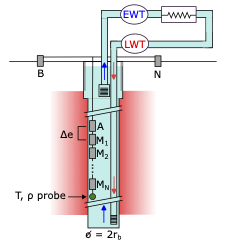

# Electrical Thermal Response Test (E-TRT)

[](https://www.python.org)
[](LICENSE)

A Python library for simulating and inverting electrical resistivity and temperature data to estimate ground thermal properties during thermal response tests in borehole systems.

## Overview

**Thermal response tests (TRT)** are essential tools for characterizing ground thermal properties in geothermal systems. However, conventional TRT methods struggle to accurately estimate the **volumetric heat capacity** (Cs) due to low sensitivity of temperature measurements and their limited spatial extent within the borehole.

This repository contains code and data supporting the research on the **Electrical Thermal Response Test (E-TRT)**, a novel joint geophysical-thermal methodology that combines:

- **Thermal measurements**: Standard TRT with temperature sensors at the borehole
- **Electrical measurements**: Simultaneous electrical resistivity monitoring using borehole electrodes

The E-TRT is illustrated by the following figure, where we see that in addition to the temperature measurements from the inlet and outlet (LWT and EWT), a multi-electrode cable is installed within the borehole and measures potential differences (Mn-N) at different electrode spacings (A-Mn).

<div align="center">
  
</div>


### Key Innovation

By leveraging the temperature-sensitivity of electrical resistivity, E-TRT provides additional constraints for thermal parameter estimation. Our results demonstrate:

- **50-70% reduction in Cs uncertainty** (synthetic experiments)  
- **Stable field-scale estimates** with low uncertainties:
   - Thermal conductivity (k): 3.8% uncertainty
   - Volumetric heat capacity (Cs): 12.4% uncertainty
   - Temperature-resistivity coupling (m): 4.7% uncertainty

- **Field validation** on a standing column well in Varennes, Canada

## Citation

If you use this code or data in your research, please cite the paper:

```bibtex
@article{SzaboSom2026ETRT,
  title={Electrical Thermal Response Test: Joint Inversion of Electrical Resistivity and Temperature Data for Enhanced Thermal Parameter Estimation},
  author={Szabo-Som, Clarissa and Fabien-Ouellet, Gabriel and Pasquier, Philippe and Dimech, Adrien},
  journal={[Journal Name]},
  year={2026},
  volume={XX},
  pages={XXX--XXX},
  doi={[DOI]}
}
```

---

## Installation

```bash
# Clone the repository
git clone https://github.com/GeoCode-polymtl/E-TRT
cd E-TRT

# Install in development mode (recommended)
pip install -e .
```


---

## Quick Start

The package provides functions for simulating temperature variations using the Infinite Cylinder Source (ICS) model or Infinite Line source (ILS), running full E-TRT simulations, and performing Bayesian inversion to estimate thermal parameters. Below are examples of how to use these functionalities. These examples are also available in the [Quickstart.ipynb](notebooks/Quickstart.ipynb) notebook.

### Step 1: Compute Temperature with ICS Model

Below is an example of how to compute temperature variations at different distances and times using the Infinite Cylinder Source (ICS) model.
```python
import numpy as np
import matplotlib.pyplot as plt
from etrt import ICS
# Compute temperature at different distances and times
T_variation = ICS(
    r=np.array([0.083]),             # distances from borehole (m)
    t=np.arange(96),                 # times (hours)
    q=5000,                          # heat injection rate (W/m)
    k=2.5,                           # thermal conductivity (W/m·K)
    c=2.3,                           # volumetric heat capacity (MJ/m³·K)
    rbh=0.083                        # borehole radius (m)
)

# Plot temperature variation over time
plt.plot(np.arange(96), T_variation)
plt.xlabel("Time (hours)")
plt.ylabel('Temperature change (K)')
plt.show()
```

### Step 2: Perform the E-TRT Simulation

We can run a full E-TRT simulation that combines both thermal and electrical responses. The example below demonstrates how to set up and execute the simulation, and then plot the results.

```python
from etrt import simulate_etrt, ert_setup
import numpy as np
import matplotlib.pyplot as plt
# Bedrock thermal parameters
C = 2.5     # volumetric heat capacity (MJ/m^3/K)
k = 2.75    # thermal conductivity (W/m/K)
m = 0.035   # coupling parameter (/degC)

# SCW parameters
rBH = 0.165/2  # Radius of borehole (m)

# Thermal parameters
T0 = 10   # Initial water temperature (degC)
q = 115.6 # Heat injection rate (W/m)

# Electrical parameters
sigma_ref = 1/15  # Rock electrical conductivity at reference (S/m)
sigmaw_ref = 0.5  # Water electrical conductivity at reference (S/m)

# Setup ERT
zrec = np.arange(0.25, 2.25, 0.25)  # Electrode separation
mesh, simulation, survey= ert_setup(zrec, mesh_selection="fast")

# Sampling times
t_TRT = np.arange(12, 48+1/6, 1/6)  # TRT sampling (h) 
t_ERT = np.arange(12, 48+2, 4)      # Electrical resistivity sampling (h)

# Run simulation
d = simulate_etrt(k, C, q, m, sigma_ref, rBH, t_ERT, t_TRT, 
                  mesh, survey, simulation)
rhoa = d[:len(t_ERT)*len(zrec)].reshape(-1, len(zrec))
dT = d[len(t_ERT)*len(zrec):]

# Plot results
fig, ax = plt.subplots(1, 1, figsize=(6, 6))
ax.plot(t_TRT, dT, "k--", label="Temperature")
ax.invert_yaxis()
ax.set_ylabel('$\\Delta $T (°C)')
ax1 = ax.twinx()
for i in range(len(zrec)):
    ax1.plot(t_ERT, rhoa[:, i], '-', label=f"e={zrec[i]} m")
ax1.legend()
ax1.set_ylabel('$\\Delta \\rho_a (\\Omega m)$')
ax.set_xlabel("Time (hours)")
plt.tight_layout()
plt.show()
```

### Step 3: Bayesian Inversion

For parameter estimation, we can perform a Bayesian inversion that combines both temperature and resistivity data. Below is an example of how to set up and execute the inversion, and then print the estimated parameters with their uncertainties.

```python
from etrt import bayesian_inversion

# Setup true and initial parameters
m0 = np.r_[2.6, 2, 0.018]
mtrue = np.r_[k, C, m]

# Covariance matrices
Cdi_trt = np.diag([1 / 0.26 ** 2] * len(t_TRT))  # TRT data covariance
Cdi_ert = np.diag(
    [1 / 0.09 ** 2] * len(t_ERT) * len(zrec))  # ERT data covariance
Cdi = np.block([
    [Cdi_ert, np.zeros((len(t_ERT) * len(zrec), len(t_TRT)))],
    [np.zeros((len(t_TRT), len(t_ERT) * len(zrec))), Cdi_trt]
])  # Combined covariance


# Standard TRT inversion
def fun(m):
    dt, J = ICS(rBH, t_TRT * 3600, q, m[0], m[1], rBH, getJ=True)
    return dt, J[:, :2]


d, Jtrt = fun(mtrue)
m_est, Cm_trt, conf_trt, *_ = bayesian_inversion(fun, d, m0[:-1], Cdi_trt, None,
                                                 10, step=0.8, doprint=True)

print('                             k         Cs')
print('True parameters           ', mtrue[:-1])
print('TRT estimated parameters', m_est)
print('TRT confidence interval', conf_trt)
print('TRT confidence interval', conf_trt / mtrue[:-1] * 100, '%')


# Joint inversion of temperature and resistivity data
def fun(m):
    return simulate_etrt(m[0], m[1], q, m[2], sigma_ref, rBH, t_ERT, t_TRT,
                         mesh, survey, simulation, getJ=True,
                         sigma_water=sigmaw_ref)


d, J = fun(mtrue)
m_est, Cm_etrt, conf_etrt, *_ = bayesian_inversion(fun, d, m0, Cdi, None, 5,
                                                   step=0.8, doprint=True)

print('                               k         Cs         m')
print('True parameters           ', mtrue)
print('E-TRT estimated parameters', m_est)
print('E-TRT confidence interval ', conf_etrt)
print('E-TRT confidence interval ', conf_etrt / mtrue * 100, '%')

```

---

## Notebooks 

We provide several notebooks that reproduces the figures of the paper and show how to apply the E-TRT and TRT inversion for the Varennes dataset. 

- [Quickstart](notebooks/Quickstart.ipynb):  Simple examples of how to use the package for simulating temperature variations, running E-TRT simulations, and performing Bayesian inversion
- [ETRT_synthetic_example](notebooks/ETRT_synthetic_example.ipynb):  Demonstrates E-TRT methodology with synthetic data and performs sensitivity analysis
- [ETRT_Varennes_data.ipynb](notebooks/ETRT_Varennes_data.ipynb): Data preprocessing and visualization of the Varennes dataset
- [ETRT_Varennes_example](notebooks/ETRT_Varennes_example.ipynb): Application of the E-TRT processing to the Varennes dataset
- [simpeg_dc_cyl.ipynb](notebooks/simpeg_dc_cyl.ipynb.ipynb): Validates DC resistivity forward modeling in cylindrical coordinates

### Running Notebooks

```bash
# Navigate to notebooks directory
cd notebooks/

# Start Jupyter
jupyter notebook

# Open desired notebook and run cells
```

---

## License

This project is licensed under the MIT License - see the [LICENSE](LICENSE) file for details.

---


